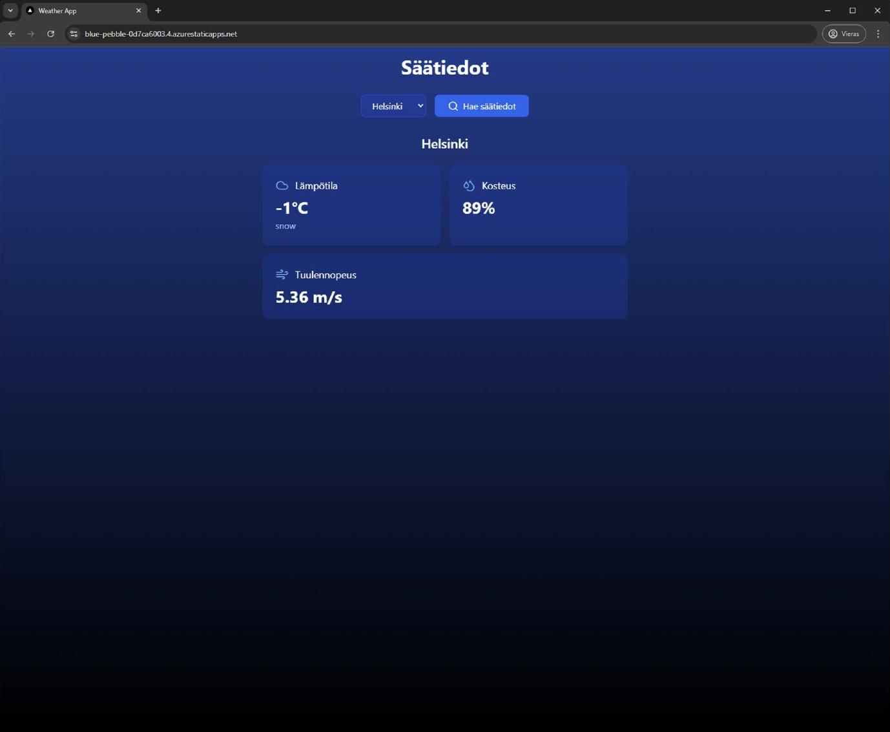

## Weather App

A modern weather application built with Next.js, TypeScript, and Tailwind CSS. Get real-time weather data for cities with a clean, responsive UI.

---

### Features
- Search weather by city
- Displays temperature, humidity, wind speed, and weather conditions
- Responsive design
- Fast and lightweight
- Ready-to-use weather icons (cloud, rain, wind, etc.) via `lucide-react`

---

### Demo Video


---

### Screenshots
<div>
  

---

### Technical Overview
- **Next.js**: React-based web application framework
- **OpenWeather API**: Source for weather data
- **Azure Static Web Apps**: Hosting platform
- **GitHub CI/CD**: Automatic deployment using GitHub Actions

---

### Requirements
- An OpenWeather API key is required to display weather details. Set your API key in the environment variable `NEXT_PUBLIC_WEATHER_API_KEY`.

---

### Getting Started

1. **Create a Next.js project**
   ```bash
   npx create-next-app@latest weather-app
   cd weather-app
   ```
2. **Install dependencies**
   ```bash
   npm install
   npm install lucide-react
   ```
   - `lucide-react` provides ready-made icons for weather conditions.
3. **Set up API key**
   - Create a `.env.local` file in the project root:
     ```env
     NEXT_PUBLIC_WEATHER_API_KEY=your_openweather_api_key
     ```
4. **Start development server**
   ```bash
   npm run dev
   ```
5. **Open in browser**
   Visit [http://localhost:3000](http://localhost:3000)

---

### Deployment

This app is deployed on Azure Static Web Apps, with automatic publishing via GitHub Actions. Any code changes pushed to the repository are automatically built and deployed to the cloud.

#### Example Azure Static Web Apps Setup
- Connect your GitHub repository to Azure Static Web Apps
- Configure build presets for Next.js
- Automatic CI/CD pipeline ensures instant updates on every commit

---

### Build & Deploy Logs
- Build and deployment status can be tracked in Azure and GitHub Actions logs
- Successful deployment provides a live URL for your app

---

### License
MIT